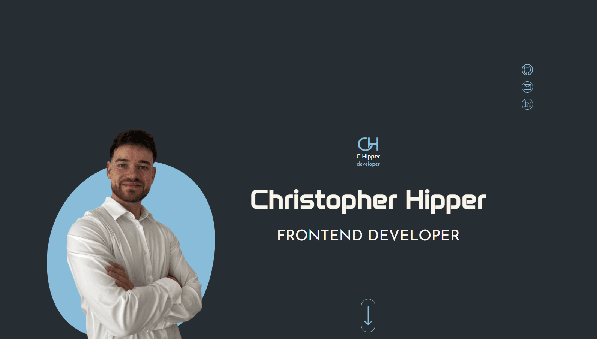

🗳️ Portfolio

## 📷 Preview




A personal portfolio designed to showcase my projects, skills, and development journey. The application focuses on a clean user interface, responsive design, and an engaging user experience while presenting my work in a professional way.

🎯 Features

📂 Showcase featured and personal projects
🛠️ Display technical skills and technologies
📱 Fully responsive design for all devices
✨ Smooth animations and interactive UI elements
📄 About me and contact section
⚡ Fast performance and optimized user experience

🛠️ Tech Stack

**Angular 20** – for building a modern single-page application  
**TypeScript** – for clean and scalable application logic  
**SCSS** – for structured and maintainable styling  

## 🚀 Getting Started

```bash
# Clone the repository
git clone https://github.com/ChristopherHipper/portfolio

# Navigate into the project
cd poll-app

# Install dependencies
npm install

# Start development server
npm start
```

The application will be available at:

```
http://localhost:4200
```

## 🏗️ Build

```bash
npm run build
```

The production build will be generated inside the `dist/` directory.

## 🧪 Running Tests

```bash
npm test
```

## 📋 Requirements

- Node.js 20+
- npm
- Angular CLI 20.3.3

Install the Angular CLI globally if you don't have it already:

```bash
npm install -g @angular/cli@20.3.3
```

## 🤝 Contributing

Pull requests are welcome! For major changes, please open an issue first to discuss what you'd like to change.

## 📄 License

This project is licensed under the MIT License.